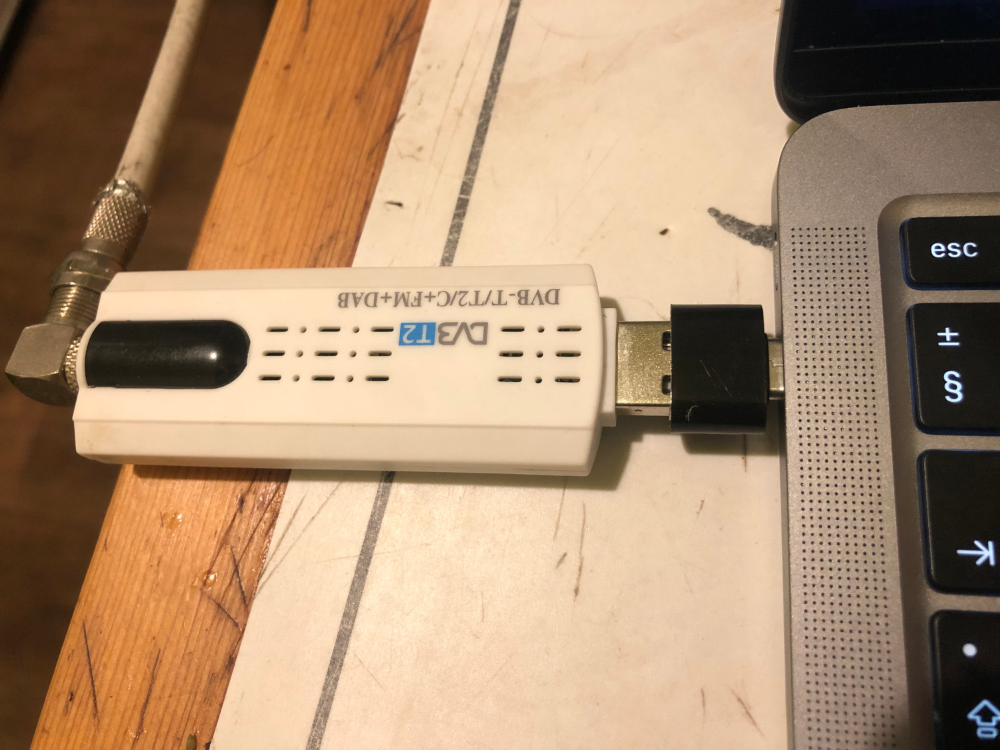
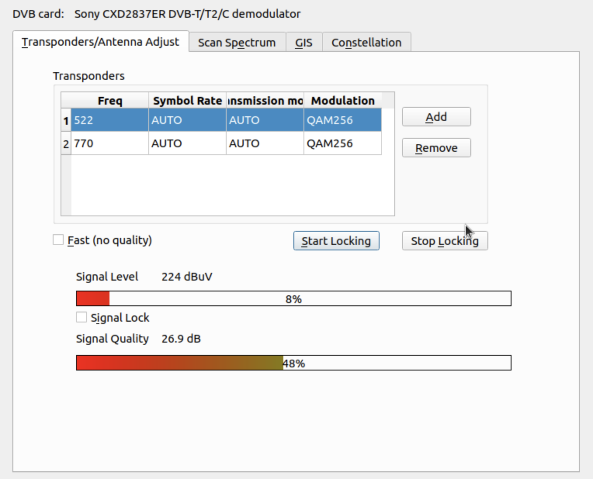
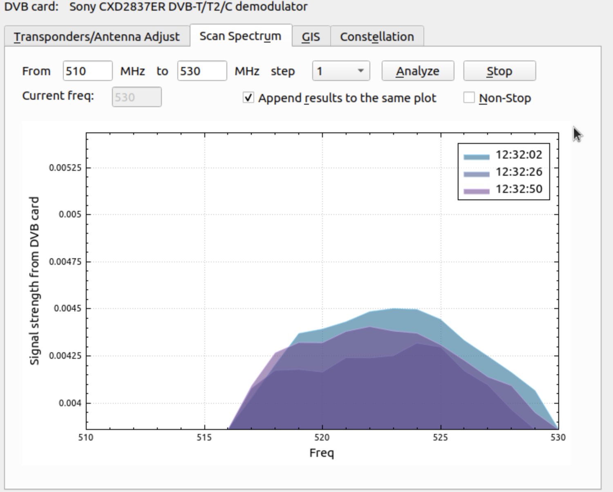
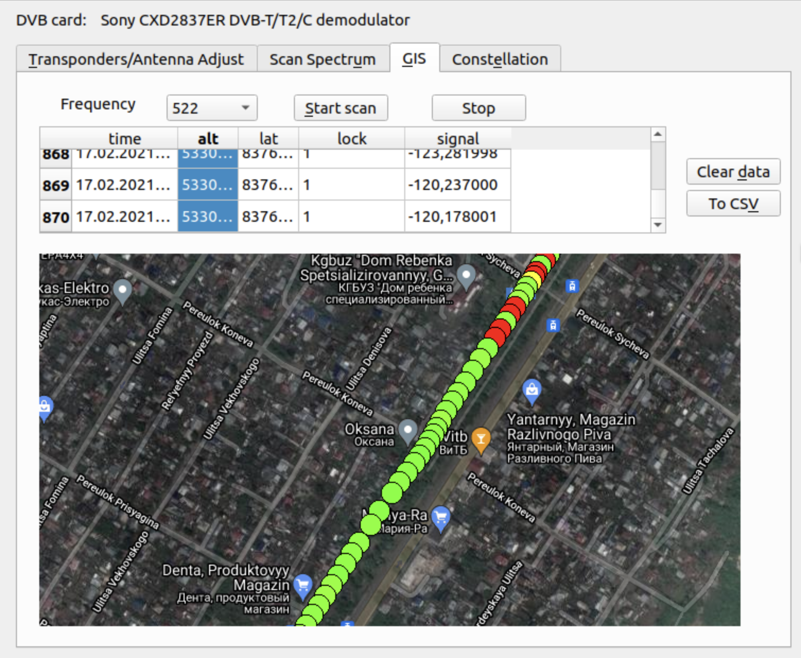
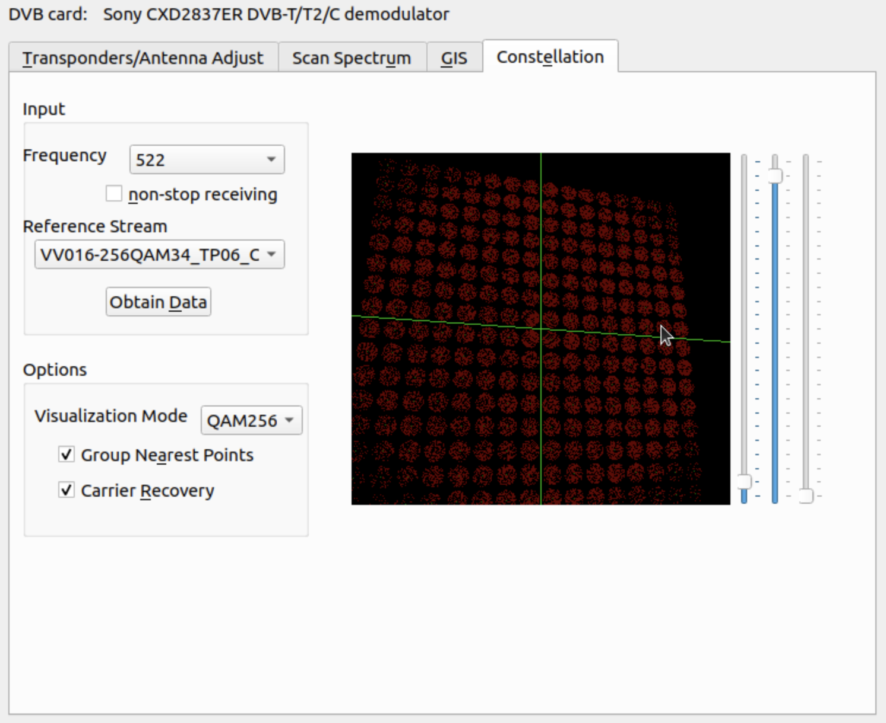
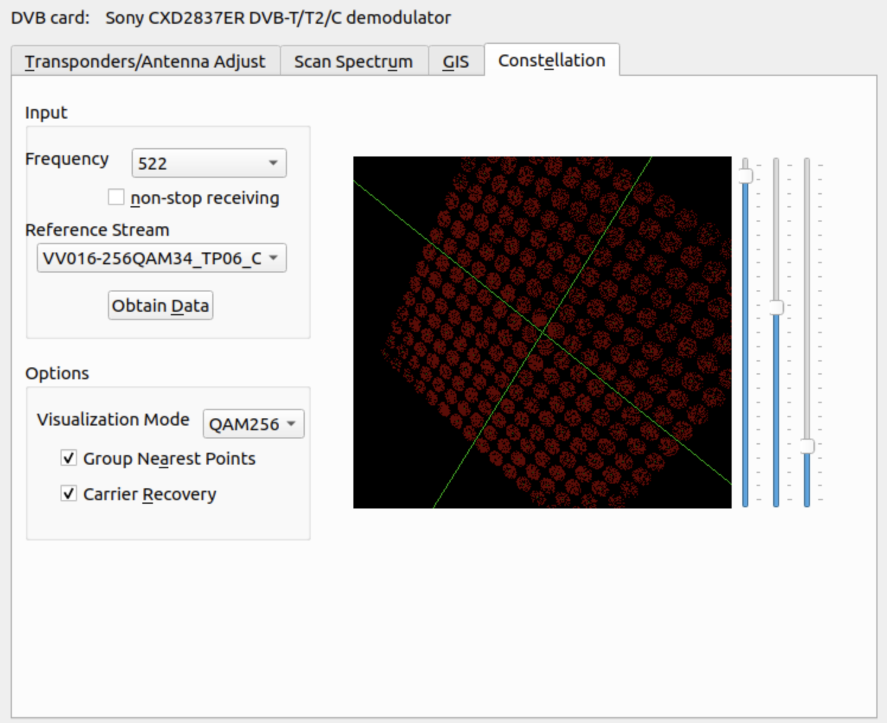

DVB-T2 Test Dialog based on Kaffeine
===================

Integrates qt plot widget, map from the mission planner project, and rtl-sdr. See <a href = "src/dvbtest">src/dvbtest</a>

It uses Kaffeine classes to work with transponders and a DVB card (tested only with Astrometa/Sony). 

It can scan spectrum, draw a map with points and visualize constellations.

Currently source state is to work only in a demo mode.

Presented at TELFOR 2021.

Please wait for updates.

For plotting, it uses QCustomPlot, a modern plotting widget for Qt by Emanuel Eichhammer       

