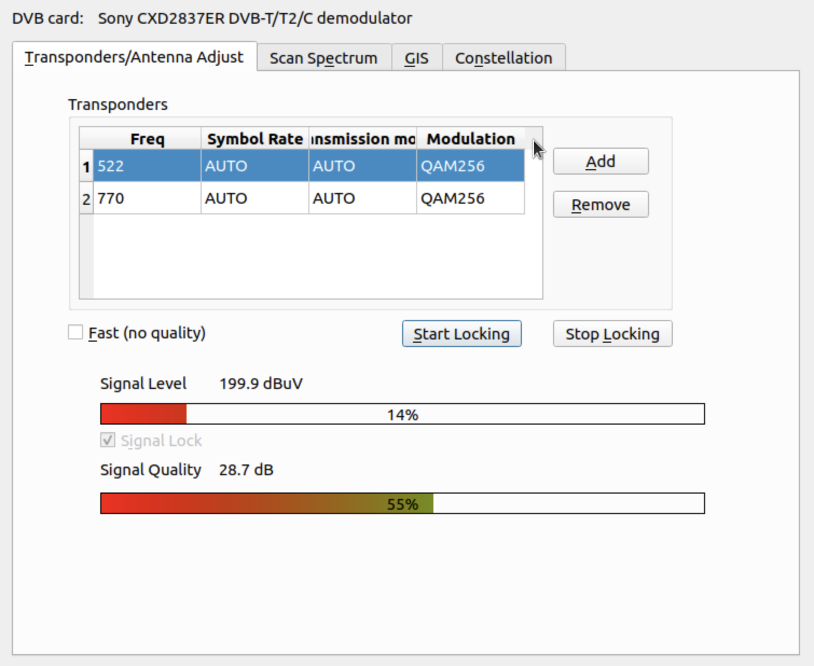

DVB-T2 Test Dialog based on Kaffeine
===================

Original player code forked from <a href="https://github.com/KDE/kaffeine">Kaffeine KDE project</a>

Integrates:
- Qt plot widget (<a href="https://gitlab.com/DerManu/QCustomPlot">QCustomPlot</a>) by Emanuel Eichhammer, 
- GIS map from the Mission Planner project (QT sources), 
- and RTL-SDR (included into src tree for a static linking, experimental as I want understand it). 

All libs are collected here and now can be built together using CMake. All my sources are here: <a href = "src/dvbtest">src/dvbtest</a>.

License: GPL. Not for professional use.

It uses Kaffeine classes to work with signal level, transponders and a DVB card (tested only with Astrometa/Sony). 

It can constantly show signal strench/quality, scan spectrum, draw a map with points and visualize constellations using OpenGL.
Added the PIDs monitoring feature.

!!Currently source state works only in a demo mode!!

Presented at TELFOR 2021. The paper on IEEE is <a href = "https://ieeexplore.ieee.org/document/9653329">here</a>.

Please wait for updates till feb 2022...





How to build
=
```
sudo apt install libudev-dev libkf5coreaddons-dev-bin libkf5coreaddons5 libvlc-dev gettext libkf5dbusaddons-dev libkf5solid-dev libkf5kio-dev libkf5xmlgui-dev libkf5windowsystem-dev libkf5i18n-dev libkf5coreaddons-dev libqt5opengl5-dev libqt5opengl5 libqt5x11extras5 libqt5x11extras5-dev libqt5svg5-dev qt5-image-formats-plugins extra-cmake-modules
```
Probably check CMakelists.
Then use cmake 

